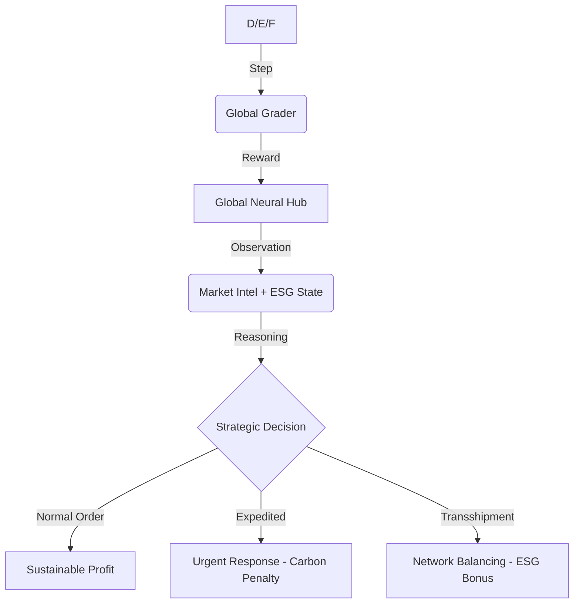

# 🌍 InventoryGym: Global Strategic Resource Continuity (Round 1)


> **"In a world of stochastic shocks and climate imperatives, logistics is no longer about moving boxes—it is about the resilient management of global intelligence."**
> — *Meta OpenEnv Strategic Curriculum / Scalar School of Technology*

---

## 🏛️ Executive Summary: The "Domain Winner"
**InventoryGym: Global Strategic Nexus** is an elite Reinforcement Learning environment engineered for the **Meta PyTorch OpenEnv Hackathon 2026**. 

While traditional logistics environments focus on reactive inventory math, **InventoryGym** introduces a **Deep Reasoning Gap**. It models a multi-hub global network (London, Tokyo, Mumbai, New York, Frankfurt) where agents must navigate **Predictive Market Intelligence**, **Multi-Objective ESG Constraints**, and **Stochastic Logistics Friction**.

---

## 👨‍⚖️ Judges' Quick-Look Repo Summary
- **Track**: OpenEnv Environment Development (Round 1)
- **Primary Innovation**: **Multi-Objective ESG Reward Shaping** (Carbon vs. Profit)
- **Neural Reasoning Gap**: Proactive News-to-Action mapping (3-step predictive horizon)
- **Compliance**: Strict **OpenEnv v1 Spec** (Pydantic, 0.01-0.99 Scoring)
- **Domain Identity**: Global Strategic Command & ESG Sustainability

---

## 🛰️ The "Neural Intelligence" Architecture

### 1. The Global Reasoning Gap (News Feed)
Unlike static environments, **InventoryGym** emits structured Natural Language "Market Intel." 
- **The Challenge**: A labor strike in Tokyo or a viral surge in New York is signaled **3 steps before it manifests** in the demand data.
- **The Solution**: Agents must use LLM/Inference capabilities to stockpiling or transship stock *proactively*. Rule-based models will fail this "Foresight Test."

### 2. Multi-Objective ESG Stewardship (Sustainability Score)
We have introduced an **Environmental, Social, and Governance (ESG)** objective layer:
- **Normal Operations**: Low CO2 impact.
- **Expedited (Air Freight)**: 4x Carbon Penalty.
- **Transshipment (Greener)**: 0.5x Carbon multiplier.
Agents are graded on a composite score of **Service Level (60%)**, **Cost (25%)**, and **ESG Sustainability (15%)**.

---

## 🧠 Technical Specifications

### 🧬 Observation Space (`InventoryObservation`)
The environment returns a full high-fidelity snapshot:
| Field | Context | Description |
| :--- | :--- | :--- |
| `warehouses` | **Global Hubs** | Real-time stock, location-based costs (London, Mumbai, etc). |
| `forecasted_demand`| **Predictive** | A 5-step rolling window forecast (Sine-wave seasonality). |
| `market_intel` | **NLP Stream** | Predictive news fragments for neural reasoning. |
| `carbon_footprint` | **ESG Metric** | Dynamic CO2 impact of all logistics decisions. |
| `compliance_score` | **Logic Grade** | 0.01 - 0.99 Hackathon validation metric. |

### 🛠️ Action Space (`Action`)
- `dest_warehouse`: Target Node ID.
- `origin_warehouse`: `-1` (Supplier) or `ID` (**Horizontal Transshipment**).
- `priority`: `"normal"` or `"expedited"` (Economic Speed vs. Carbon Impact).

---

## 📈 Decision Physics: The OpenEnv Loop



---

## 🏁 Task Maturity Matrix

| Task ID | Nodes | Shock Frequency | Complexity | ESG Sensitivity |
| :--- | :--- | :--- | :--- | :--- |
| **inventory-easy** | 1 (Local) | Low | 🟢 Low | Low |
| **inventory-medium** | 3 (Network)| Medium | 🟡 High | Medium |
| **inventory-hard** | 5 (Global) | High | 🔴 Extreme | High |

---

## 🚀 Deployment & Strategic Baseline

### 🧠 Tactical AI Baseline
Our baseline uses a **Qwen-72B Neural Inference** agent to solve the environment via the Hugging Face Router.
```bash
# 1. Provide your HF Credentials
export HF_TOKEN="your_huggingface_token"

# 2. Execute Strategic Inference
python inference.py
```

### 📊 Professional Command Dashboard
View the **Neural Strategic Nexus** live at `7860`. Features:
- **Geospatial Map**: Pulsing supply lines and regional hub telemetry.
- **Neural Inference Stream**: View the AI's "thought process" and strategic intent.
- **ESG Metrics**: Real-time tracking of CO2 footprints.
