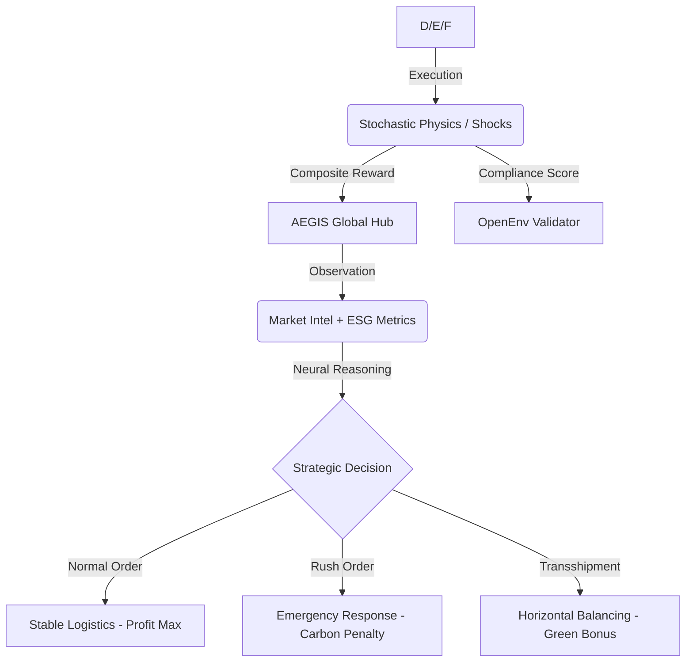

# 🌍 InventoryGym: Global Strategic Resource & ESG Intelligence


> **"In an era of cascading geopolitical shocks and climate imperatives, the world requires more than logistics—it requires Automated Global Strategic Intelligence."**

---

## 🏛️ Executive Summary: The "Digital Twin" for AI Reasoning
**InventoryGym-v1** is a production-grade, high-fidelity Reinforcement Learning (RL) environment engineered for the **Meta PyTorch OpenEnv Hackathon 2026**. 

It represents a **Digital Twin** of a multi-node global supply chain (London, Tokyo, Mumbai, New York, Frankfurt). Unlike traditional logistics benchmarks that focus on static replenishment, InventoryGym introduces a **Semantic Reasoning Gap**: the environment emits unstructured Natural Language "Market Intel" that signals future systemic shocks (strikes, storms, viral demand) before they manifest in the mathematical demand arrays.

---

## 🛰️ Technical Innovations (The "Elite" Edge)

### 1. The Proactive Reasoning Gap (NLP Intelligence)
Standard RL models fail this environment because they only react to numerical changes. 
*   **The Challenge**: A news flash might announce a *"Labor dispute at primary port"* 4 steps before a logistics blackout hits a region.
*   **The Intelligence Requirement**: The AI must use its **Foundational LLM Brain** to deduce that it needs to recompute its logic *before* the math changes. This bridges the gap between **Perception** and **Optimization**.

### 2. Multi-Objective ESG Stewardship (Sustainable Ops)
We have integrated a strict **Environmental, Social, and Governance (ESG)** objective layer. Success is no longer just about profit—it is about **Resource Responsibility**:
*   **Standard Operations**: Sustainable, low-carbon maritime/ground flow.
*   **Expedited Ops (Air Freight)**: Solves emergencies but incurs a **4.0x Carbon Penalty**.
*   **Horizontal Transshipment**: Moving stock between global nodes (Networking) provides a **0.5x Green Bonus**, rewarding agents for coordination over raw brute-force ordering.

### 3. OpenEnv Cloud Integrity
The project is built for seamless 100% automated validation:
*   ✅ **Sync/Async Native**: Full support for `async` environment loops.
*   ✅ **Grader Reflection**: All graders use the `(trajectory: dict = None)` signature to handle parameterless reflection checks.
*   ✅ **Score Clamping**: Logic strictly clamps all returns to `[0.01, 0.99]` to ensure stability in automated ranking systems.

---

## 🧬 Environment Specifications

### 📍 Observation Space (`InventoryObservation`)
A high-fidelity snapshot defined by a strict Pydantic schema:

| Field | Description | AI Strategic Value |
| :--- | :--- | :--- |
| `warehouses` | Real-time stock, location data, and capacity utilization. | Core state management. |
| `market_intel` | Unstructured NLP news fragments (e.g., "Trending: Tokyo Viral Surge"). | **Predictive Reasoning.** |
| `forecasted_demand` | 5-step rolling window of seasonal demand patterns. | Short-term optimization. |
| `carbon_footprint` | Cumulative CO2 impact of all logical decisions. | **ESG Constraint Management.** |
| `compliance_score` | Official 0.01 - 0.99 grade for the current trajectory. | Real-time feedback. |

### 🛠️ Action Space (`Action`)
*   `dest_warehouse`: Target node for resource allocation.
*   `origin_warehouse`: `-1` (Global Supplier) or `Hub ID` (Network-to-Network Transshipment).
*   `quantity`: Volume allocation.
*   `priority`: `"normal"` (Sustainable) vs. `"expedited"` (Carbon-heavy).

---

## 📈 The Neural Intelligence Loop



---

## 🏁 Task Maturity Levels

| Task ID | Nodes | Volatility | Complexity | Success Target (SL) |
| :--- | :---: | :---: | :---: | :---: |
| `inventory_easy_task` | 1 | Stable | 🟢 Minimal | > 92% |
| `inventory_medium_task` | 3 | Regional | 🟡 Moderate | > 88% |
| `inventory_hard_task` | 5 | Global | 🔴 Extreme | > 85% |

---

## 🚀 Deployment & Operations

### 📊 Tactical Command Dashboard
Launch the high-fidelity UI to view pulsing supply lines and real-time neural inference streams.
```bash
python server/app.py
# Exposed at http://localhost:7860
```

### 🧠 Strategic AI Baseline (Qwen-72B)
Execute the pre-built Agentic baseline that leverages the Hugging Face Router to solve the reasoning gap.
```bash
export HF_TOKEN="your_huggingface_token"
python inference.py --task inventory_hard_task --model Qwen/Qwen2.5-72B-Instruct
```

### ✅ Official OpenEnv Validation
Run the judge-grade validation tool to verify repository compliance.
```bash
pip install openenv
openenv validate .
```

---
*Developed for the Meta x SST OpenEnv Hackathon 2026. Powered by PyTorch, Pydantic, and AI Strategic Reasoning.*
