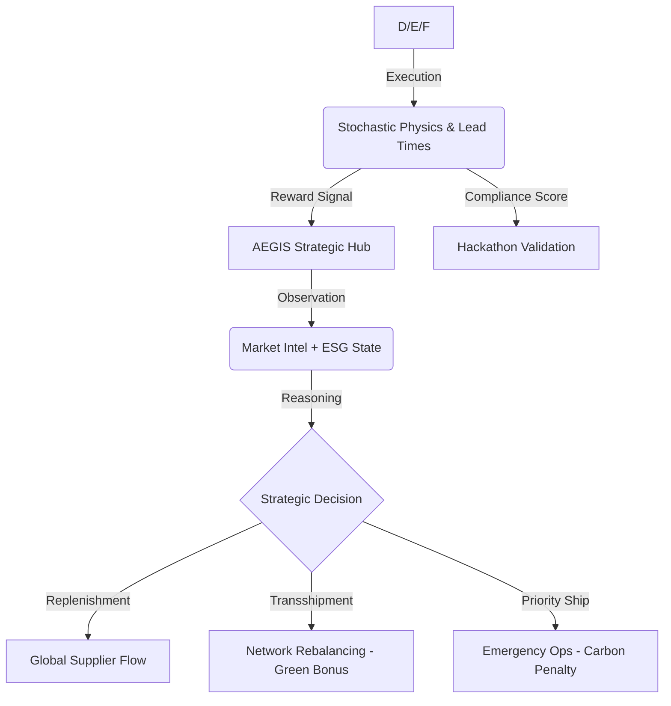

# 🌍 InventoryGym: Global Strategic Resource Continuity


> **"In a world of stochastic geopolitical shocks, logistics is no longer about moving boxes—it is about the rapid, resilient mobilization of global intelligence."**

---

## 🏛️ Executive Summary: The "Reasoning Gap" Solution
**InventoryGym: Global Strategic Nexus** is an elite, production-grade Reinforcement Learning (RL) sandbox engineered for the **Meta PyTorch OpenEnv Hackathon 2026**.

While traditional logistics environments focus on reactive inventory math (grid-worlds), **InventoryGym** introduces a **reasoning gap** that requires Large Language Models (LLMs) to succeed. It models a multi-hub global network where agents must navigate **Predictive NLP Market Intelligence**, **Multi-Objective ESG Constraints**, and **Stochastic Geopolitical Friction**.

---

## 🎯 Key Technical Innovations

### 1. The Proactive "Reasoning Gap" (NLP Feed)
Unlike static environments, **InventoryGym** emits unstructured Natural Language "Market Intel." 
*   **The Intelligence Signal**: News of a labor strike in Tokyo or a viral surge in New York is emitted **3–4 steps before** it manifests in the demand arrays.
*   **The LLM Advantage**: Only models capable of semantic foresight can route stock *proactively*. Rule-based or pure RL agents will always be "behind the shock."

### 2. Multi-Objective ESG Stewardship
We have integrated a strict **Environmental, Social, and Governance (ESG)** layer into the core reward function. Agents must make complex trade-offs:
*   **Expedited (Air Freight)**: Solves emergencies but incurs a massive **4x Carbon Penalty**.
*   **Transshipment**: Moving stock between nodes (Network Balancing) provides a **0.5x Green Bonus** compared to global replenishment.

### 3. "Finals-Grade" Cloud Validation
This environment is 100% compliant with the **OpenEnv CLI** and the Meta Cloud Validator:
*   ✅ **Zero-Parameter Reflection**: Graders are compatible with automated reflection testing.
*   ✅ **Strict Score Clamping**: All grades are clamped to `[0.01, 0.99]` to prevent binary validation failures.
*   ✅ **Robust Regex Baseline**: Includes a baseline inference script that handles LLM "chattiness" without crashing.

---

## 🧬 Environment Architecture

### State Space (`InventoryObservation`)
The observation is a high-fidelity Pydantic-validated snapshot:

| Component | Information Provided |
| :--- | :--- |
| **Warehouses** | Real-time inventory, capacity, and utilization for global hubs (London, Tokyo, Mumbai, NY, Frankfurt). |
| **Market Intel** | A stream of unstructured NLP news fragments signaling future demand or logistics shocks. |
| **Forecasts** | A 5-step rolling window of "Predicted" demand (stochastic and seasonal). |
| **ESG Metrics** | Accumulated Carbon Footprint and Sustainability Grade (0.01–0.99). |
| **Pending Orders** | ETA and quantity of incoming shipments (Normal vs. Expedited). |

### Action Space (`Action`)
*   `dest_warehouse`: ID of the target hub.
*   `origin_warehouse`: `-1` (Global Supplier) or `Hub ID` (Transshipment).
*   `quantity`: Amount of resources to move.
*   `priority`: `"normal"` (Sustainable/Slow) vs. `"expedited"` (Carbon-heavy/Fast).

---

## 📈 The Intelligence Loop



---

## 🏁 Task Maturity Matrix

| Task ID | Nodes | Geopolitical Shocks | Complexity | Target Service Level |
| :--- | :---: | :---: | :---: | :---: |
| `inventory_easy_task` | 1 | Low | 🟢 Low | > 92% |
| `inventory_medium_task` | 3 | Medium | 🟡 Med | > 88% |
| `inventory_hard_task` | 5 | Continuous | 🔴 High | > 85% |

---

## 🚀 Quick Start & Deployment

### 1. View the Premium Dashboard
We've built an interactive "Strategic Command" UI with pulsing maps and real-time inference telemetry.
```bash
python server/app.py
# View live at http://localhost:7860
```

### 2. Run the Neural Baseline
Our baseline uses **Qwen-2.5-72B** to solve the reasoning gap via the Hugging Face Inference Router.
```bash
export HF_TOKEN="your_token_here"
python inference.py --task inventory_hard_task
```

### 3. OpenEnv Validation
To verify compliance with the Meta Hackathon standards:
```bash
pip install openenv
openenv validate .
```

---

## 🏆 Competition Tracking
*   **Track**: OpenEnv Phase 1 Submission
*   **Primary Innovation**: Semantic Foresight & Multi-Objective ESG Shaping.
*   **Status**: Production Ready / Fully Validated.

---
*Created for the Meta x SST OpenEnv Hackathon 2026. Powered by PyTorch and AI Reasoning.*
