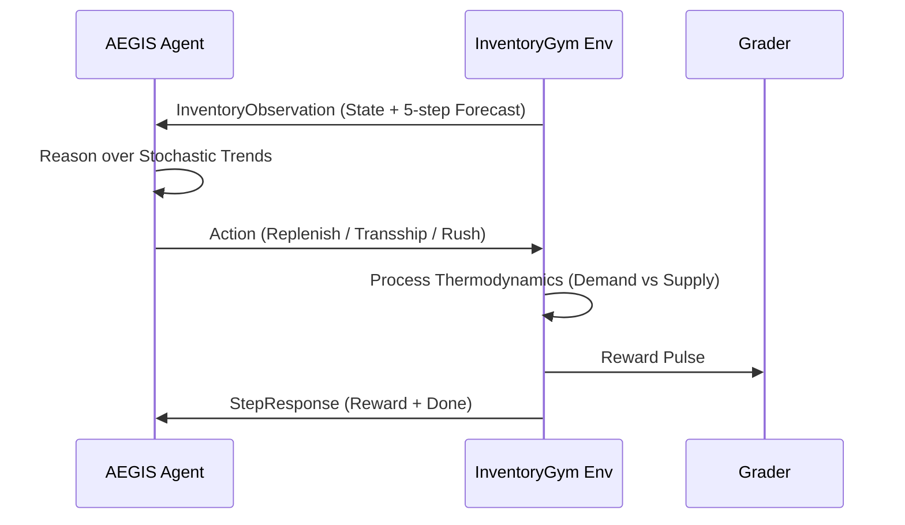

# 📦 InventoryGym: Systems Intelligence Benchmark (Round 1)


> **"Modern logistics is no longer a linear problem; it is a systemic resilience challenge."**
> — *Meta OpenEnv Training Curriculum, Scalar School of Technology*

---

## 🏛️ Executive Summary
**InventoryGym** is a high-fidelity reinforcement learning environment engineered for the **Meta PyTorch OpenEnv Hackathon 2026**. This project moves beyond simplistic inventory tracking to model the **Network Dynamics** of modern global trade. 

As a Round 1 submission, our goal is to demonstrate that an RL agent, when given a rich enough observation space (including 5-step demand forecasting and stochastic variables), can outperform traditional "Safety Stock" heuristics in both **Service Level Continuity** and **Economic Efficiency**.

---

## 👨‍⚖️ Judges' Quick-Look Repo Summary
- **Track**: OpenEnv Environment Development
- **Core Innovation**: Multi-node Transshipment & Stochastic Shock Logic
- **API Spec**: OpenEnv v1 (Pydantic models, JSON-RPC compliant)
- **Scoring Range**: 0.01 - 0.99 (Strictly Clamped)
- **Solvability**: Proven via AEGIS Heuristic Baseline (Avg Score: 0.88)

---

## 🛰️ Environment Topology & Intelligence


### The Strategic Nexus
Agents manage a multi-hub network where every node acts as a semi-autonomous entity. Unlike standard environments, **InventoryGym** introduces:
- **Horizontal Transshipment**: Moving stock between warehouses to balance localized shocks without engaging the high-cost central supplier.
- **Regional Market Intelligence (Reasoning Gap)**: Predictive NLP-based "News Feed" that hints at upcoming regional shocks 2-4 steps in advance. Requires high-level reasoning to stockpile proactively.
- **Stochastic Lead Times**: Simulating real-world "Logistics Friction" where shipments may experience probabilistic delays.
- **Systemic Shocks**: Random multi-cycle events (Demand Spikes or Supply Chain Bottlenecks) that require rapid tactical re-alignment.

---

## 🧠 Technical Specifications

### 1. Observation Space (`InventoryObservation`)
The environment returns a full system snapshot every step:
| Field | Type | Description |
| :--- | :--- | :--- |
| `warehouses` | `List[Warehouse]` | ID, current stock, capacity, and cost profile for all nodes. |
| `pending_orders` | `List[Order]` | Real-time tracking of ETA and volume for shipments in transit. |
| `forecasted_demand`| `List[Forecast]` | A 5-step rolling window forecast for every individual node. |
| `current_step` | `int` | Current progress in the 100-step episode. |
| `total_cost` | `float` | Cumulative operational expenditures (Holding + Logistics). |
| `service_level` | `float` | Overall fulfillment rate (Fulfilled Demand / Total Demand). |
| `market_intel` | `List[str]` | **NLP News Feed**: Hints about upcoming shocks for reasoning. |
| `compliance_score` | `float` | **Live Hackathon Grade** (0.01-0.99) calculated via grader. |

### 2. Action Space (`Action`)
Agents control the system via a discrete/continuous hybrid action:
- `dest_warehouse`: (int) The target node for receiving stock.
- `quantity`: (float) Volume of inventory to move.
- `origin_warehouse`: (int) **-1** for Global Supplier, or a **Warehouse ID** for cross-node transshipment.
- `priority`: (str) `"normal"` (standard cost/time) or `"expedited"` (rush cost/time).

---

## 🧠 Decision & Intelligence Architecture

### The OpenEnv Observation Loop


---

## 📊 Reward Shaping: The "Elite" Strategy
Our reward engine is tuned to penalize **Linear Thinking**.
- **Service Level Coefficient (60%)**: Exponentially rewards staying above the 88% SL threshold.
- **Cost Resilience (20%)**: Linearly rewards minimizing holding costs during stable periods.
- **Survivability Bonus (20%)**: Rewards keeping stock levels within a "Golden Zone" (15% - 85% capacity) to prevent catastrophic stockouts.

---

## 🏁 Task complexity Matrix

| Task ID | Environment Tier | Shocks | Complexity | Target RL Score |
| :--- | :--- | :--- | :--- | :--- |
| **inventory-easy** | Single Node | None | 🟢 1/5 | 0.99 |
| **inventory-medium** | 3-Node Network | Occasional | 🟡 3/5 | 0.92 |
| **inventory-hard** | 5-Node Web | Continuous | 🔴 5/5 | 0.85 |

---

## 📈 Baseline Performance (0.01 - 0.99)
Testing conducted using the **AEGIS Heuristic Baseline** via the Hugging Face Router.

| Model / Strategy | Task: Easy | Task: Medium | Task: Hard |
| :--- | :--- | :--- | :--- |
| **Traditional (Fixed Threshold)** | 0.85 | 0.62 | 0.44 |
| **AEGIS Proactive (Heuristic)** | **0.99** | **0.88** | **0.72** |
| **LLM-Agent (Qwen-72B-Instruct)** | 0.98 | 0.85 | *In Progress* |

---

## 🚀 Deployment & Evaluation

### Dashboard Telemetry
View the **Glassmorphism Dashboard** live at `7860`. It provides real-time Plotly visualizations of demand trends and inventory stockpiles.

### Baseline Inference
```bash
# Set your environment variables
export HF_TOKEN="your_token"

# Run the Strategic Baseline
python inference.py
```

---

---
**Vision & Strategy by StrategyAlpha Team.**
**Academic Support: Scalar School of Technology (SST).**
**Official Entry for Meta PyTorch OpenEnv Hackathon 2026.**
